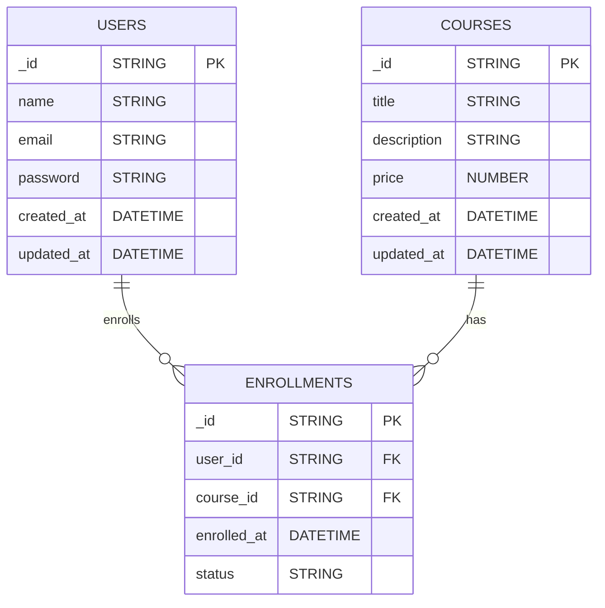
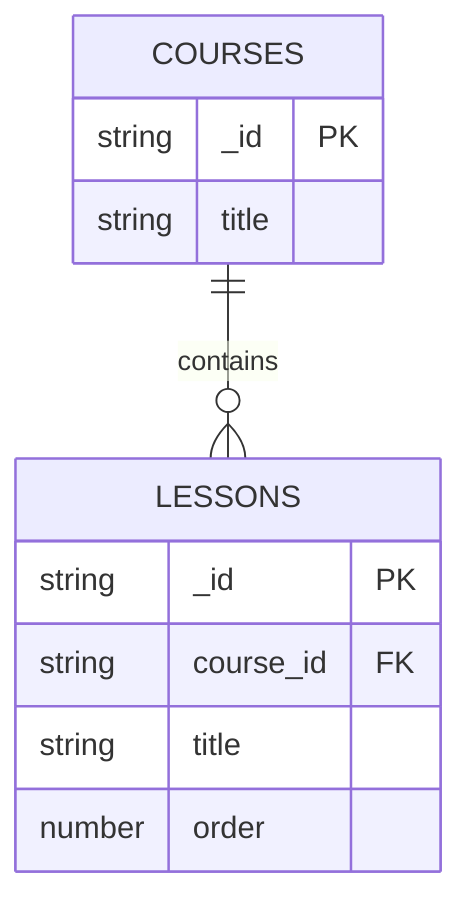
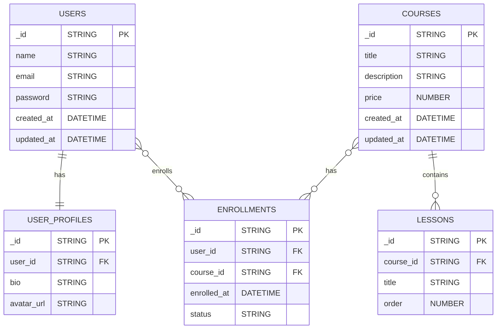

## ER Diagram

An ER diagram shows entities, their attributes, and how they relate to each other.

- **Entity**: a real-world object or concept, like `Users` or `Courses`.
- **Attribute**: a property of an entity, like `name` or `email`.
- **Primary Key (PK)**: a unique identifier for each row.
- **Foreign Key (FK)**: a field that points to the primary key of another table.
- **Relationship**: how entities connect, such as one user enrolling in many courses.

---

### Basic Learning Platform Example

In a basic learning platform, these entities are common:

- **Users**: students or instructors
- **Courses**: available courses
- **Enrollments**: connects users and courses

### How it works

- One `USER` can have many `ENROLLMENTS`.
- One `COURSE` can have many `ENROLLMENTS`.
- `ENROLLMENTS` acts as a bridge table to model the many-to-many relationship between `USERS` and `COURSES`.

---

### Another Example: Courses and Lessons

### Types of Relationships

Relationships describe how entities connect in a database:

- **One-to-One (1:1)**: One entity is associated with exactly one other entity. Example: One user has one profile.
- **One-to-Many (1:M)**: One entity is associated with many instances of another entity. Example: One course has many lessons.
- **Many-to-Many (M:M)**: Many instances of one entity are associated with many instances of another entity. Example: Many users enroll in many courses.

- **USERS ↔ USER_PROFILES**: One-to-One (1:1) - Each user has exactly one profile.
- **COURSES ↔ LESSONS**: One-to-Many (1:M) - One course contains many lessons.
- **USERS ↔ ENROLLMENTS ↔ COURSES**: Many-to-Many (M:M) - Many users enroll in many courses through enrollments.